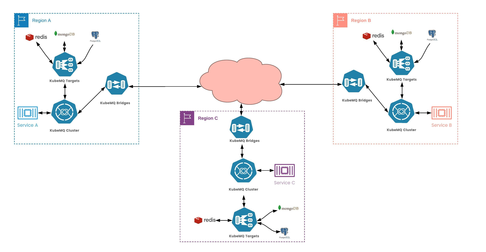
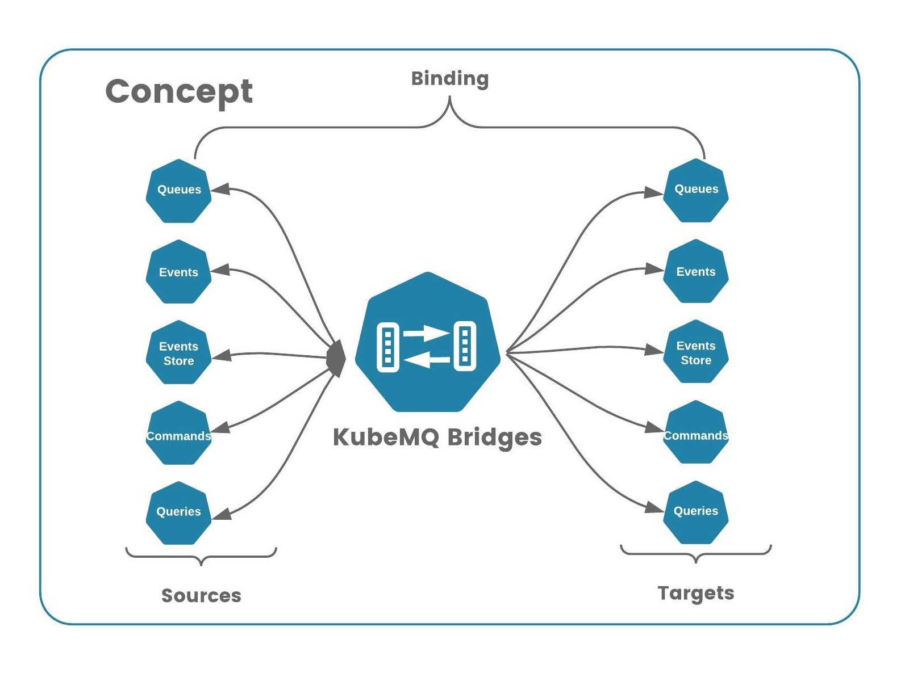
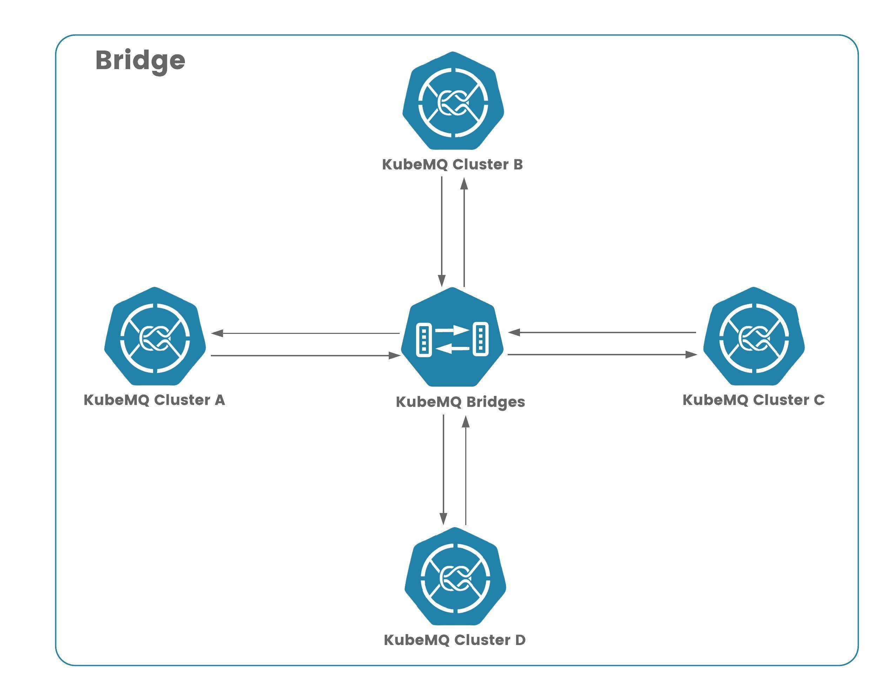

# KubeMQ Bridges

KubeMQ Bridges bridge, replicate, aggregate, and transform messages between KubeMQ clusters no matter where they are, allowing to build a true cloud-native messaging single network running globally.

**Key Features**:

- **Runs anywhere**  - Kubernetes, Cloud, on-prem , anywhere
- **Stand-alone** - small docker container / binary
- **Build Any Topology** - connects KubeMQ clusters in 1:1, 1:n , n:1, n:n
- **Middleware Supports** - Logs, Metrics, Retries and Rate Limiters
- **Easy Configuration** - simple yaml file builds your topology

**An example of a use case:**



## Concept

KubeMQ Bridges' concept is bridging between sources and targets, thus Bindings.

Binding can be any source kinds to any target kinds, as shown below:



KubeMQ Bridges can support any binding topology :

| Topology   | Description                                                                                   | Sources-Targets        |
|:----------|:----------------------------------------------------------------------------------------------|:-----------------------|
| Bridge    | a 1:1 connectivity mainly for sync type of messages                                           | one source to 1 target   |
| Replicate | a 1:n connectivity allowing  replicating messages between clusters                            | one source to n targets  |
| Aggregate | an n:1 connectivity allowing aggregating streams fo messages from clusters to a single target | n source to 1 target   |
| Transform | an n:n mix and match sources and targets in many to many topology                               | n sources to n targets |


### Bridge



[**See an example**](/examples/bridge)
### Replicate


[**See an example**](/examples/replicate)
### Aggregate


[**See an example**](/examples/aggregate)

### Transform


[**See an example**](/examples/transform)

## Installation

### Kubernetes

An example of kubernetes deployment can be find below:

```yaml
apiVersion: core.k8s.kubemq.io/v1alpha1
kind: KubemqConnector
metadata:
  name: kubemq-bridges
spec:
  type: bridges
  replicas: 1
  config: |-
    bindings:
      - name: bridges-example-binding
        properties:
          log_level: "info"
        sources:
          kind: source.events
          name: cluster-sources
          connections:
            - address: "kubemq-cluster-grpc:50000"
              client_id: "cluster-events-source"
              channel: "events.source"
              group:   ""
              concurrency: "1"
              auto_reconnect: "true"
              reconnect_interval_seconds: "1"
              max_reconnects: "0"
        targets:
          kind: target.events
          name: cluster-targets
          connections:
            - address: "kubemq-cluster-grpc:50000"
              client_id: "cluster-events-target"
              channels: "events.target"
```
### Binary (Cross-platform)

Download the appropriate version for your platform from KubeMQ Bridges Releases. Once downloaded, the binary can be run from anywhere.

Ideally, you should install it somewhere in your PATH for easy use. /usr/local/bin is the most probable location.

Running KubeMQ Bridges

```bash
kubemq-bridges --config config.yaml
```


### Windows Service

1. Download the Windows version from KubeMQ Bridges Releases. Once downloaded, the binary can be installed from anywhere.
2. Create config.yaml configuration file and save it to the same location of the Windows binary.


#### Service Installation

Run:
```bash
kubemq-bridges.exe --service install
```

#### Service Installation With Username and Password

Run:
```bash
kubemq-bridges.exe --service install --username {your-username} --password {your-password}
```

#### Service UnInstall

Run:
```bash
kubemq-bridges.exe --service uninstall
```

#### Service Start

Run:
```bash
kubemq-bridges.exe --service start
```


#### Service Stop

Run:
```bash
kubemq-bridges.exe --service stop
```

#### Service Restart

Run:
```bash
kubemq-bridges.exe --service restart
```

**NOTE**: When running under Windows service, all logs will be emitted to Windows Events Logs.


## Configuration

KubeMQ Bridges loads configuration file on startup. The configuration file is a yaml file that contains definitions for bindings of Sources and Targets.

The default config file name is config.yaml, and KubeMQ bridges search for this file on loading.

### Structure

Config file structure:

```yaml

apiPort: 8080 # kubemq bridges api and health end-point port
bindings:
  - name: clusters-sources # unique binding name
    properties: # Bindings properties such middleware configurations
      log_level: error
      retry_attempts: 3
      retry_delay_milliseconds: 1000
      retry_max_jitter_milliseconds: 100
      retry_delay_type: "back-off"
      rate_per_second: 100
    sources:
      kind: source.query # Sources kind
      name: name-of-sources # sources name 
      connections: # Array of connections settings per each source kind
        - .....
    targets:
      kind: target.query # Targets kind
      name: name-of-targets # targets name
      connections: # Array of connections settings per each target kind
        - .....
```
### Build Wizard

KubeMQ Bridges configuration can be build with --build flag

```
./kubemq-bridges --build
```

### Properties

In bindings configuration, KubeMQ Bridges supports properties setting for each pair of source and target bindings.

These properties contain middleware information settings as follows:

#### Logs Middleware

KubeMQ Bridges supports level based logging to console according to as follows:

| Property  | Description       | Possible Values        |
|:----------|:------------------|:-----------------------|
| log_level | log level setting | "debug","info","error" |
|           |                   |  "" - indicate no logging on this bindings |

An example for only error level log to console:

```yaml
bindings:
  - name: sample-binding 
    properties: 
      log_level: error
    sources:
    ......  
```

#### Retry Middleware

KubeMQ Bridges supports Retries' target execution before reporting of error back to the source on failed execution.

Retry middleware settings values:


| Property                      | Description                                           | Possible Values                             |
|:------------------------------|:------------------------------------------------------|:--------------------------------------------|
| retry_attempts                | how many retries before giving up on target execution | default - 1, or any int number              |
| retry_delay_milliseconds      | how long to wait between retries in milliseconds      | default - 100ms or any int number           |
| retry_max_jitter_milliseconds | max delay jitter between retries                      | default - 100ms or any int number           |
| retry_delay_type              | type of retry delay                                   | "back-off" - delay increase on each attempt |
|                               |                                                       | "fixed" - fixed time delay                  |
|                               |                                                       | "random" - random time delay                |

An example for 3 retries with back-off strategy:

```yaml
bindings:
  - name: sample-binding 
    properties: 
      retry_attempts: 3
      retry_delay_milliseconds: 1000
      retry_max_jitter_milliseconds: 100
      retry_delay_type: "back-off"
    sources:
    ......  
```

#### Rate Limiter Middleware

KubeMQ Bridges supports Rate Limiting of target executions.

Rate Limiter middleware settings values:


| Property        | Description                                    | Possible Values                |
|:----------------|:-----------------------------------------------|:-------------------------------|
| rate_per_second | how many executions per second will be allowed | 0 - no limitation              |
|                 |                                                | 1 - n integer times per second |

An example for 100 executions per second:

```yaml
bindings:
  - name: sample-binding 
    properties: 
      rate_per_second: 100
    sources:
    ......  
```

### Sources

Sources section contains sources configuration for binding as follows:

| Property    | Description                                       | Possible Values                                               |
|:------------|:--------------------------------------------------|:--------------------------------------------------------------|
| name        | sources name (will show up in logs)               | string without white spaces                                   |
| kind        | source kind type                                  | source.queue                                                  |
|             |                                                   | source.queue-stream                                           |
|             |                                                   | source.query                                                  |
|             |                                                   | source.command                                                |
|             |                                                   | source.events                                                 |
|             |                                                   | source.events-store                                           |
| connections | an array of connection properties for each source | [queue configuration](/sources/queue)               |
|             |                                                   | [query configuration](/sources/query)               |
|             |                                                   | [command configuration](/sources/command)           |
|             |                                                   | [events configuration](/sources/events)             |
|             |                                                   | [events-store configuration](/sources/events-store) |


### Targets

Targets section contains target configuration for binding as follows:

| Property    | Description                                       | Possible Values                                               |
|:------------|:--------------------------------------------------|:--------------------------------------------------------------|
| name        | targets name (will show up in logs)               | string without white spaces                                   |
| kind        | source kind type                                  | target.queue                                                  |
|             |                                                   | target.query                                                  |
|             |                                                   | target.command                                                |
|             |                                                   | target.events                                                 |
|             |                                                   | target.events-store                                           |
| connections | an array of connection properties for each target | [queue configuration](/targets/queue)               |
|             |                                                   | [query configuration](/targets/query)               |
|             |                                                   | [command configuration](/targets/command)           |
|             |                                                   | [events configuration](/targets/events)             |
|             |                                                   | [events-store configuration](/targets/events-store) |


