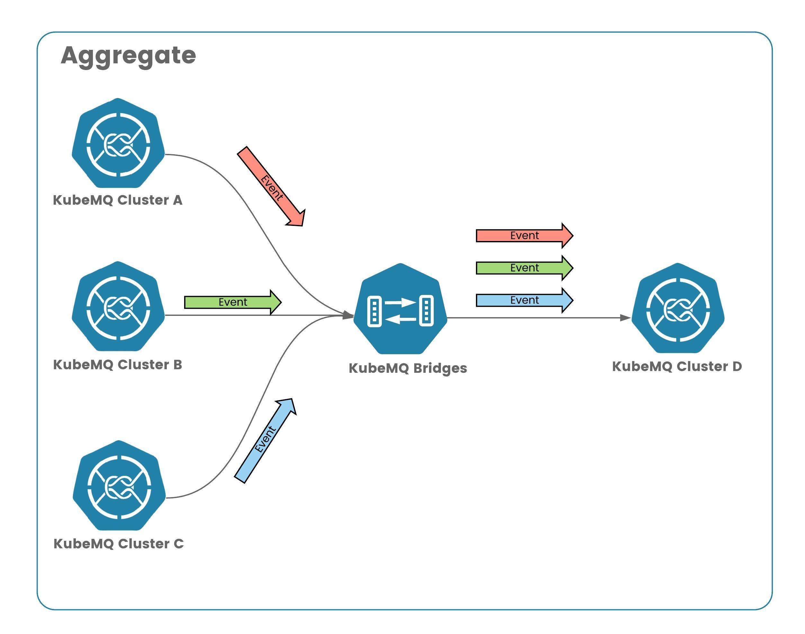

# KubeMQ Bridges - Aggregate Example

In this example we demonstrate how to aggregate data from multiple clusters as sources (in this case events) and send all the events to single cluster as targets for further processing.



## Run

Run the following deployment

```bash
kubectl apply -f ./deploy.yaml
```
Where deploy.yaml:

```yaml
apiVersion: core.k8s.kubemq.io/v1alpha1
kind: KubemqCluster
metadata:
  name: kubemq-cluster-a
  namespace: kubemq
spec:
  replicas: 3
  grpc:
    expose: NodePort
    nodePort: 30501
---
apiVersion: core.k8s.kubemq.io/v1alpha1
kind: KubemqCluster
metadata:
  name: kubemq-cluster-b
  namespace: kubemq
spec:
  replicas: 3
  grpc:
    expose: NodePort
    nodePort: 30502
---
apiVersion: core.k8s.kubemq.io/v1alpha1
kind: KubemqCluster
metadata:
  name: kubemq-cluster-c
  namespace: kubemq
spec:
  replicas: 3
  grpc:
    expose: NodePort
    nodePort: 30503
---
apiVersion: core.k8s.kubemq.io/v1alpha1
kind: KubemqCluster
metadata:
  name: kubemq-cluster-d
  namespace: kubemq
spec:
  replicas: 3
  grpc:
    expose: NodePort
    nodePort: 30504
---
apiVersion: apps/v1
kind: Deployment
metadata:
  name: kubemq-bridges-deployment
  namespace: kubemq
  labels:
    app: kubemq-bridges
spec:
  replicas: 1
  selector:
    matchLabels:
      app: kubemq-bridges
  template:
    metadata:
      labels:
        app: kubemq-bridges
    spec:
      containers:
        - name: kubemq-bridges
          image: kubemq/kubemq-bridges:latest
          ports:
            - containerPort: 8080
          volumeMounts:
            - mountPath: /kubemq-bridges/config.yaml
              name: config-file
              subPath: config.yaml
      volumes:
        - name: config-file
          configMap:
            name: kubemq-bridges-config
            items:
              - key: config.yaml
                path: config.yaml
---
apiVersion: v1
kind: ConfigMap
metadata:
  name: kubemq-bridges-config
  namespace: kubemq
data:
  config.yaml: |-
    apiPort: 8081
    bindings:
      - name: cluster-a-d-events-aggregate
        properties:
          log_level: "debug"
        sources:
          kind: source.events
          name: cluster-a-events-source
          connections:
            - address: "kubemq-cluster-a-grpc.kubemq.svc.cluster.local:50000"
              client_id: "cluster-a-events-source"
              auth_token: ""
              channel: "events.a"
              group:   ""
              concurrency: "1"
              auto_reconnect: "true"
              reconnect_interval_seconds: "1"
              max_reconnects: "0"
            - address: "kubemq-cluster-b-grpc.kubemq.svc.cluster.local:50000"
              client_id: "cluster-b-events-source"
              auth_token: ""
              channel: "events.b"
              group:   ""
              concurrency: "1"
              auto_reconnect: "true"
              reconnect_interval_seconds: "1"
              max_reconnects: "0"
            - address: "kubemq-cluster-c-grpc.kubemq.svc.cluster.local:50000"
              client_id: "cluster-c-d-events-source"
              auth_token: ""
              channel: "events.c"
              group:   ""
              concurrency: "1"
              auto_reconnect: "true"
              reconnect_interval_seconds: "1"
              max_reconnects: "0"
        targets:
          kind: target.events
          name: cluster-a-d-events-target
          connections:
            - address: "kubemq-cluster-d-grpc.kubemq.svc.cluster.local:50000"
              client_id: "cluster-a-d-events-target"
              auth_token: ""
              channels: "events.aggregate"


```

