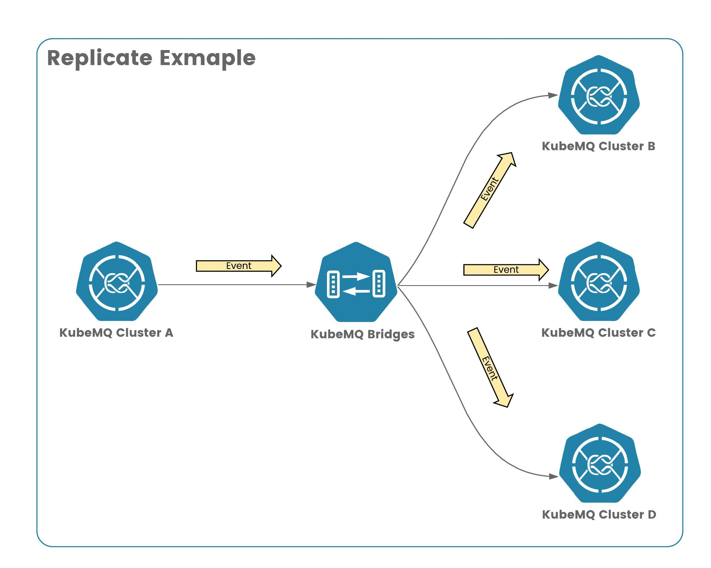

# KubeMQ Bridges - Replicate Example

In this example we demonstrate how to replicate messages from one cluster as source to multiple clusters as targets.



## Run

Run the following deployment

```bash
kubectl apply -f ./deploy.yaml
```
Where deploy.yaml:

```yaml
apiVersion: core.k8s.kubemq.io/v1alpha1
kind: KubemqCluster
metadata:
  name: kubemq-cluster-a
  namespace: kubemq
spec:
  replicas: 3
  grpc:
    expose: NodePort
    nodePort: 30501
---
apiVersion: core.k8s.kubemq.io/v1alpha1
kind: KubemqCluster
metadata:
  name: kubemq-cluster-b
  namespace: kubemq
spec:
  replicas: 3
  grpc:
    expose: NodePort
    nodePort: 30502
---
apiVersion: core.k8s.kubemq.io/v1alpha1
kind: KubemqCluster
metadata:
  name: kubemq-cluster-c
  namespace: kubemq
spec:
  replicas: 3
  grpc:
    expose: NodePort
    nodePort: 30503
---
apiVersion: core.k8s.kubemq.io/v1alpha1
kind: KubemqCluster
metadata:
  name: kubemq-cluster-d
  namespace: kubemq
spec:
  replicas: 3
  grpc:
    expose: NodePort
    nodePort: 30504
---
apiVersion: core.k8s.kubemq.io/v1alpha1
kind: KubemqConnector
metadata:
  name: kubemq-bridges
spec:
  type: bridges
  replicas: 1
  image: kubemq/kubemq-bridges:latest
  config: |-
    bindings:
    - name: clusters-sources
      properties:
        log_level: "debug"
      sources:
        kind: source.queue
        connections:
          - address: "kubemq-cluster-a-grpc.kubemq.svc.cluster.local:50000"
            channel: "queue1"
      targets:
        kind: target.queue
        name: cluster-targets
        connections:
          - address: "kubemq-cluster-b-grpc.kubemq.svc.cluster.local:50000"
            channels: "queue1"
          - address: "kubemq-cluster-c-grpc.kubemq.svc.cluster.local:50000"
            channels: "queue1"
          - address: "kubemq-cluster-d-grpc.kubemq.svc.cluster.local:50000"
            channels: "queue1"
```

